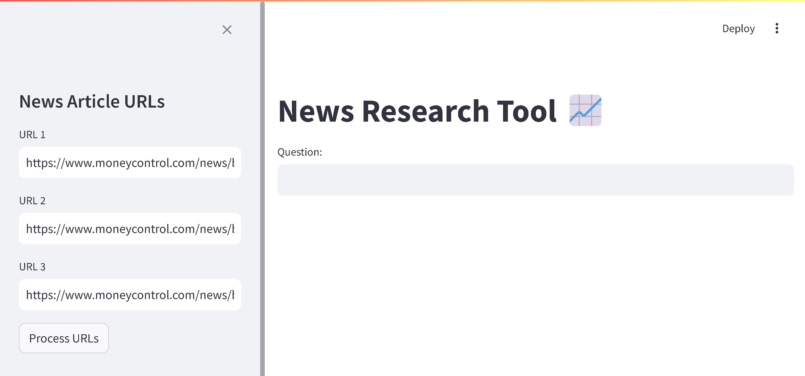
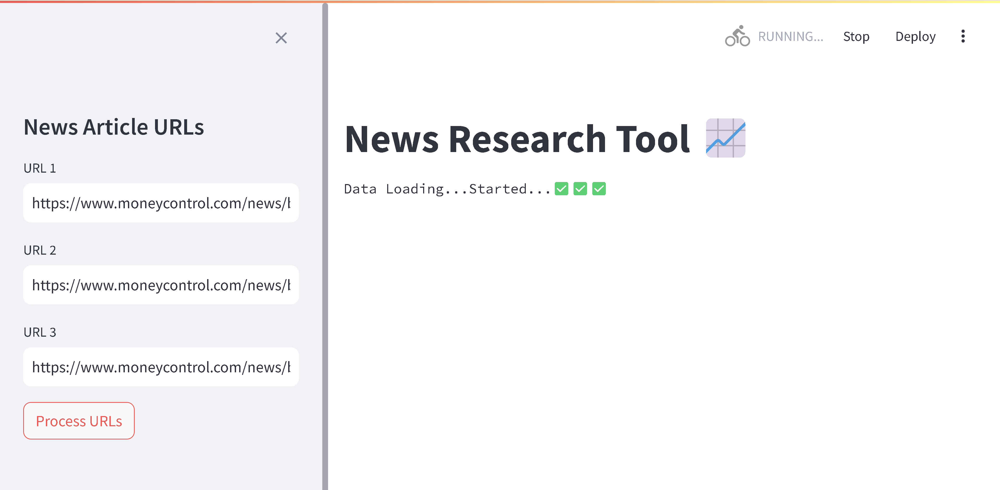
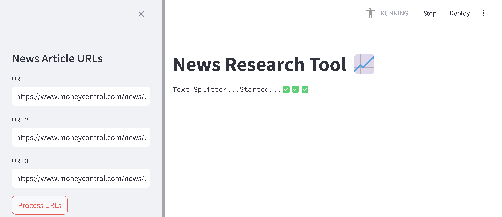
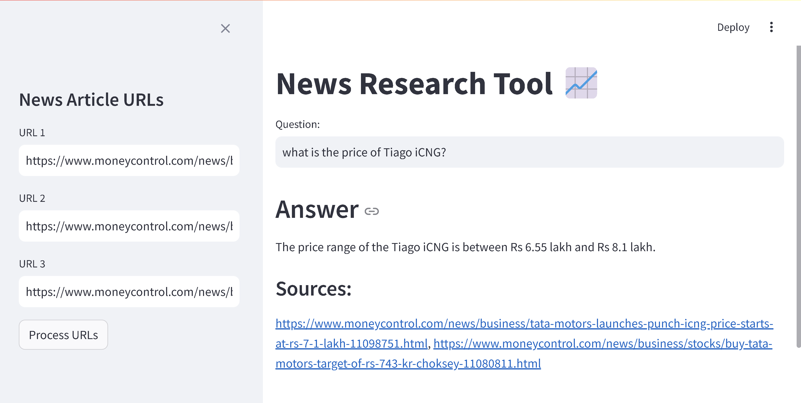
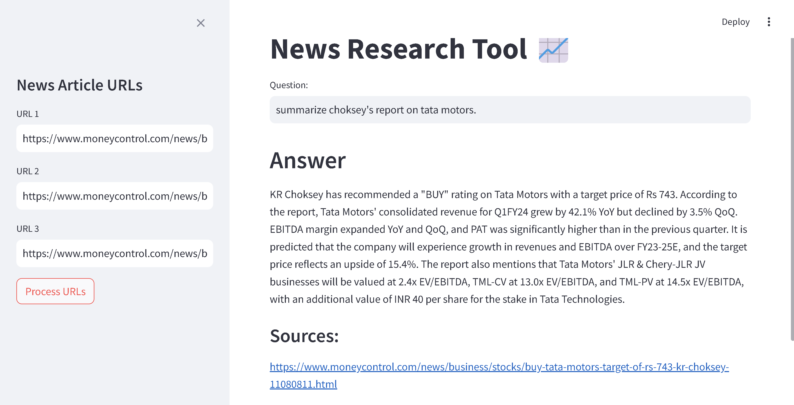

# Article-Question-Answer-Tool
This project is built to analyse and answer any query given related to information sources that are given in the form of URLs.  

This is a POC (Proof of Concept).

Issues Resolved with this project:
- Copy pasting whole article texts is tedious task.
- Aggregated and fucused knowledge base can't be provided manually websites like chatGPT.
- Word limits in tools like chatGPT is very limited.

## Pre-requisites
- Use python=3.11 environment
- Make .env file
- Write the following in it.
    - OPENAI_API_KEY='enter your openapi key here'
- Run the app.py file.
    
## Text loading and splitting

Documents --> splits --> merged splits (overlapped chunks)

## Vector Database

Chunks --> embeddings --> database(faiss) 

## Retrieving similar chunks from the database

prompt --> embedding --> database semantic search --> most relevant chunks

## Passing the query and the chunks to OpenAI LLM

- Stuff method - The retrieved chunks and the query are stuffed and then send to the LLM.
    - May exceed the maximum token limit of the LLM.

- Map-Reduce Method - Each chunk will be sent to the LLM with the question individually, the all the responses will be concatenated and then finally sent to the LLM with the initial question.
    - More LLM calls
    - initial individual prompts would look something like this:
        - "Use the following portion of a long document to see if any of the text is relevant to answer the question. \nReturn any relevant text verbatim.....(chunk1)"
        - Similarily all the other chunks will go the llm individually.
    - Then summarized 

## Images

 
 

 
 

 
 

 
 

## URLs

- https://www.moneycontrol.com/news/business/tata-motors-mahindra-gain-certificates-for-production-linked-payouts-11281691.html
- https://www.moneycontrol.com/news/business/tata-motors-launches-punch-icng-price-starts-at-rs-7-1-lakh-11098751.html
- https://www.moneycontrol.com/news/business/stocks/buy-tata-motors-target-of-rs-743-kr-choksey-11080811.html
  
## Suggestions
- Use brightdata

